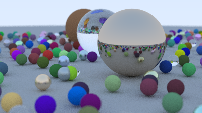

# Ray Tracer

A path-traced ray tracer in C++17, built from scratch following the *Ray Tracing in One Weekend* series.



## Features

- [x] Lambertian (diffuse) material
- [x] Metal material with adjustable fuzz
- [x] Dielectric (glass) material with Schlick reflectance
- [x] Anti-aliasing via stochastic sampling
- [x] Positionable camera with vertical FOV
- [x] Defocus blur (depth of field)
- [x] PNG output via stb_image_write
- [ ] BVH acceleration structure (in progress)
- [ ] Multi-threaded rendering (in progress)

## Build

Requires CMake 3.15+ and a C++17 compiler.

```bash
cmake -B build
cmake --build build
./build/ray_tracer
```

Output is saved as `images/final_render.png`.

## Architecture

Header-only components in `src/`:

| File | Responsibility |
|------|----------------|
| `vec3.h` | 3D vector math with operator overloads |
| `ray.h` | Parameterized ray (origin + direction) |
| `hittable.h` | Abstract base for intersectable objects |
| `sphere.h` | Sphere primitive with quadratic intersection |
| `hittable_list.h` | Composite of multiple hittables |
| `material.h` | Lambertian, Metal, Dielectric materials |
| `camera.h` | Positionable camera with defocus blur and timing instrumentation |
| `image_writer.h` | PNG output with gamma correction |

## Performance

Baseline (no optimizations yet):

| Configuration | Hardware | Render Time |
|--------------|----------|-------------|
| 400×225, 100 spp, max depth 50, ~500 spheres | 1.4 GHz Quad-Core Intel i5 | 495s |

Target after BVH + multi-threading: **< 30 seconds**.

## References

- *[Ray Tracing in One Weekend](https://raytracing.github.io/books/RayTracingInOneWeekend.html)* by Peter Shirley