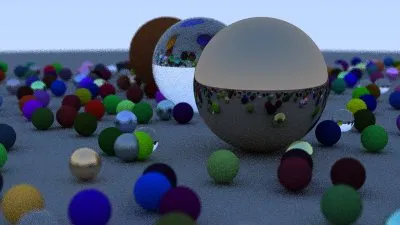

# Ray Tracer

A multi-threaded path tracer in C++17, built from scratch following the *Ray Tracing in One Weekend* series.



## Features

- [x] Vector math library (`vec3`)
- [x] Ray-sphere intersection
- [x] Positionable camera with vertical FOV
- [x] Anti-aliasing via stochastic sampling
- [x] Lambertian (diffuse) material
- [x] Metal material with adjustable fuzz
- [x] Dielectric (glass) material with Schlick reflectance
- [x] Defocus blur (depth of field)
- [ ] BVH acceleration structure (in progress)
- [ ] Multi-threaded rendering (in progress)

## Build

```bash
cmake -B build
cmake --build build
./build/ray_tracer > output.ppm
```

## Architecture

The renderer is organized as a small set of header-only components:

- `vec3.h` — 3D vector math with operator overloads
- `ray.h` — parameterized ray (origin + direction)
- `hittable.h` — abstract base for intersectable objects
- `sphere.h` — sphere primitive with quadratic intersection
- `hittable_list.h` — composite of multiple hittables
- `material.h` — Lambertian, Metal, Dielectric materials
- `camera.h` — positionable camera with defocus blur
- `color.h` — gamma-corrected color output (PPM format)

## Performance

Baseline (no optimizations):
- **Test scene**: 400×225, 100 samples/pixel, max depth 50, ~500 spheres
- **Hardware**: 1.4 GHz Quad-Core Intel Core i5 (2020 MacBook Pro)
- **Render time**: **495 seconds** (single-threaded, no acceleration structure)

Target after Week 2 (BVH + multi-threading): **< 30 seconds**.

## References

- *[Ray Tracing in One Weekend](https://raytracing.github.io/books/RayTracingInOneWeekend.html)* by Peter Shirley